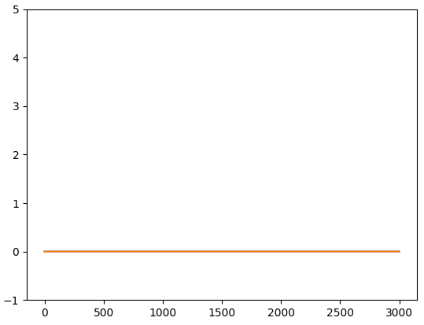
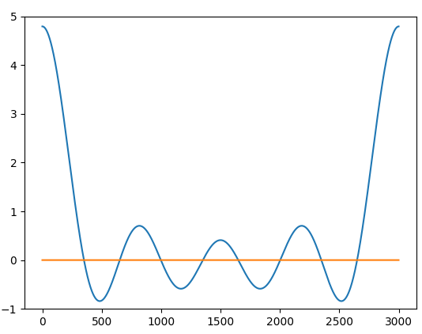

# 问题

已知特征值l，
求解
$$
-y''+q(x)y=l y\\ y(0)=0 , y(1)=0
$$
中的q

# 代码思路

采用Numerical algorithms for inverse Sturm-Liouville problems复现即可。

# 测试

## 失败测试

1. pytorch禁止自替代运算（内存上重复的算符，例如a=inv(a)），例如 x=f(q)之后又写 x=g(q)，不应该出现+=等自替代符号，以下代码也是违法的
    ```
    self.TrainPower=torch.zeros((s,K1,K1))
    self.TrainPower[i]=self.TrainPower[i]+torch.mm(self.TrainPower[1],self.TrainPower[i-1])
    ```

    原因是前后出现自替代,改为

    ```
    self.TrainPower=[torch.zeros((K1,K1)) for i in range(s+1)]
    self.TrainPower[i]=self.TrainPower[i]+torch.mm(self.TrainPower[1],self.TrainPower[i-1])
    ```

2.论文的M矩阵是从1开始记数的，不是0

## 成功测试

假定特征值为$(n\pi)^2$，众所周知q=0，测试运行test.py/test1()，当N=1的时候，得到下图（蓝色线与橙色线几乎重叠）拟合结果$10^{-7}$



然而，可能会注意到N=5时，拟合结果$10^{-5}$



个人认为，有可能是因为这两个势函数本身产生的特征值太接近了，才导致出现这样的结果。
